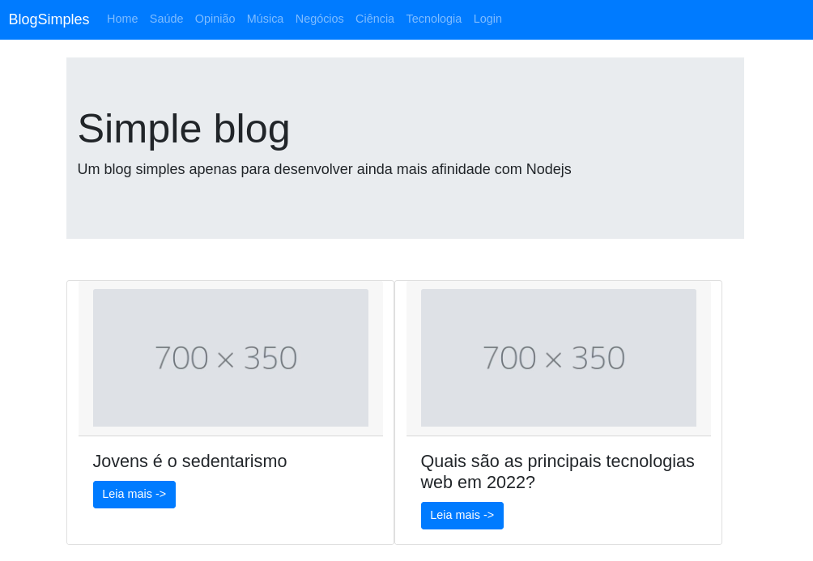

# Blog simples

<!---Esses são exemplos. Veja https://shields.io para outras pessoas ou para personalizar este conjunto de escudos. Você pode querer incluir dependências, status do projeto e informações de licença aqui--->

<!---  --->
  
> Ideia de blog simples para criar artigos e as categorias desses artigos.Intenção desse projeto é ter ainda mais familiariadade com librarys do NodeJS

### Ajustes e melhorias

O projeto ainda está em desenvolvimento e as próximas atualizações serão voltadas nas seguintes tarefas:

- [ ] Terminar o login de administrativo
- [ ] Mehorar o front end de listagens de artigos 
- [ ] Mehorar o front_end no geral

